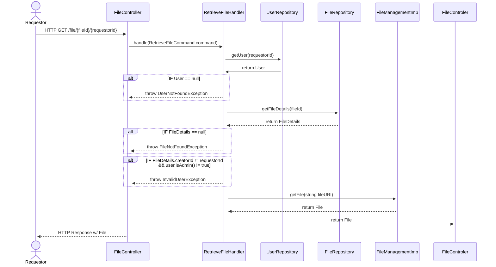
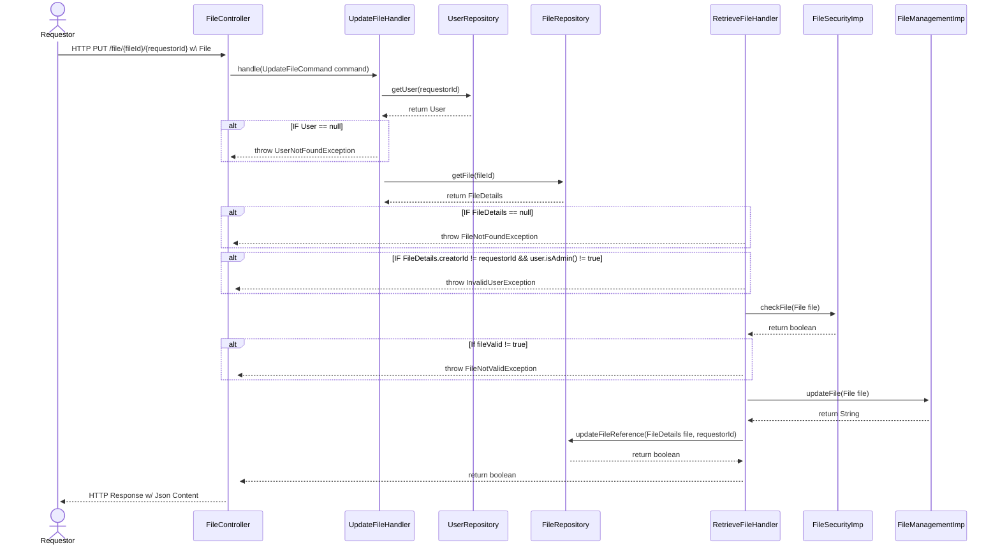

# ___Sequence Diagrams___
The purpose of these sequence diagrams is to map out the interactions that will occur within the codebase whenever a User sends an HTTP request to an API.

The sequence diagrams will be used during the **Requirement Analysis** process to define work-items and during development. This will increase the speed of Agile Software Development because the work-items will be well-defined based on the intended design of the system.

## ___User Functionality___

### ___Get User By ID___

### ___Create User___

### ___Delete User___

### ___Update User___

## ___File Functionality___

### ___Create File___

### ___Get File___

### ___Update File___
