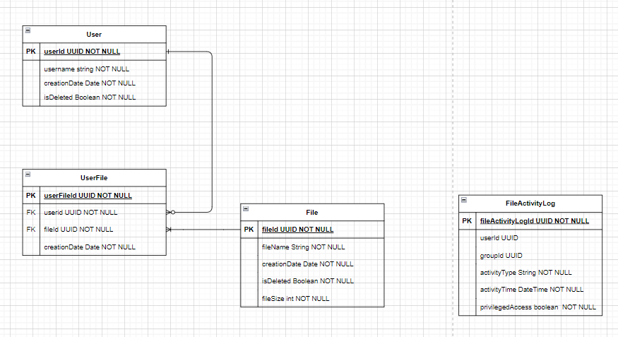

# ___Design Documentation___
Based on the information derived from the previous steps within the RDD process. A preliminary design has been created primarily taking into account the technical considerations whenever deciding on the system's architecture.

## ___Proposed System Architecture___

1. **Microsoft Azure** has been chosen as the single Cloud Services Provider within this system.
    - In-order to improve my knowledge of Microsoft Azure as I work towards AZ-204 Certification.
    - I have pre-existing knowledge about developing solutions using Azure.
2. **Blob Storage** was chosen as the File Storage solution because:
    - Blog Storage's access tiers will improve the solution's cost effectiveness. Since data must be stored within our solution for an indefinite period of time, being able to store file's which are in-frequently accessed in **Cold** or **Archive** tier storage will **reduce storage costs**.
    - Blob Storage has client libaries for a large number of programming languages meaning our choice of development language isn't restricted by this technology.
    - Blob Storage automatically **encrypts and decrypts files at rest using AES-256**.

3. **App Service** has been chosen to host the storage application. 
    - Integration with DevOps CICD pipelines such as GitHub Actions.
    - Ability to automatically scale to respond to changes in traffic.
    - Support for Containerisation and Docker.

4. **SQL Database** has been chosen to store the application's structured information such as User and File related information.
    - Supports Data Encryption at Rest using AES and 3DES.

### ___Areas of Potential Change___
1. The interaction between the User and Storage Application may change whenever this application is introduced into a larger **Product Architecture**.
    - A **Front-End Application** may be used to interact with the Storage application.
    - In a Product Architecture, Back-End Services such as the Storage application may be behind a **Reverse Proxy**.  
    - A **Load Balancer** could be used to balance traffic between difference instances of the Storage Application. *Role could be covered by Reverse Proxy.
2. Azure Blob Storage could be replaced with **Azure Files**.
    - To allow the developer to gain experience with Azure Files.
3. Azure App Service could be replaced with a difference application hosting environment such as **Azure Container Instances** or **Azure Kubernetes Clusters**.

## ___Proposed Database Entity Relationship___

1. User entity is used to represent all users such Normal Users and Administrators.
2. Users are linked to the File's entity via the UserFile entity.
3. Administrative Users are linked to Groups via the UserGroup entity.
    - Groups are used to represent the different Admin roles such as **Admin**, **File Admin** & **Database Admin**.
4. The FileActivityLog entity will be used to log every Create, Read, Update or Delete event which occurs for any file within the system. This will allow for a traceable audit log to be produced.